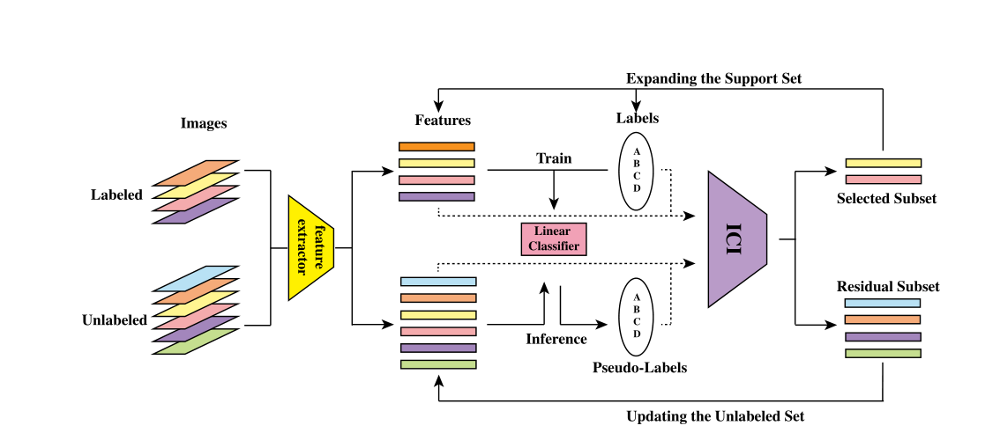

#          Instance Credibility Inference for Few-Shot Learning

# 						                              小样本学习中的实例可信度推断

**self-training（自学习）**：自学习是一种常见的使用无标签样本帮助模型学习的策略。模型在有标签的样本上进行训练后，给无标签样本打上伪标签，并利用有伪标签的无标签样本训练模型。然而，伪标签的可信度需要打上问号，如何剔除错误标记的样本引来的问题，是自学习中的一个重要问题。

本文提出一种基于数据增强的小样本学习算法（**Instance Credibility Inference ICI 实例可信度推断**）。本文的数据增强是靠**self-training**（自训练）的方式来实现的，首先利用**有标签的样本**训练体征提取器和分类器，然后**无标签样本**经过特征提取和简单线性分类后得到预测的**伪标签**。利用**ICI**选择**伪标签**中**置信度较高**的样本，将其扩充到支持集；而**置信度较低**的样本用于更新到无标签数据集中。通过迭代训练的方式来足部改善分类器的效果，网络流程图如下：

!(C:\Users\Vanous\AppData\Roaming\Typora\typora-user-images\image-20210727095017511.png)

对于样本点$(x_i,y_i)$,出去回归系数β外，假设存在与该样本点相关的参数$γ_i$​,网络预测的结果为：
$$
y_i=x_i^T\beta+γ_i+\epsilon_i
$$
**特征向量**:  $x_i∈R^{d×1}$​​​                分类的**系数矩阵**：$\beta∈R^{d×N}$​​​                           $y_i∈R^{1×N}$​​​​

$\epsilon_i$​是均值为0，方差$\sigma^2$​的高斯噪声   

$\gamma_{i,j}$用于修正实例i属于$y_i$的概率，$\gamma_{i,j}$的模$||\gamma_{i,j}||$越大，表明实例i分配给类别j的难度越大

在统计领域中，相关的研究往往关注于如何求解一个更加鲁棒性的β，使得$\gamma_i$的影响降到最低。而本文假设对β的估计$\hat\beta$较弱时，$\gamma_i$的估计$\hat\gamma_i$可反映样本点的拟合难度。例如，将$\gamma_i$视为线性回归模型$x_i^T\beta$估计的修正，$||\gamma_i||$越大，回归模型对该样本的拟合程度越差；当该样本点的标签为伪标签时，可反映该样本点的可信程度。

**优化问题**如下：
$$
(\hat\beta,\hat\gamma)\quad=\quad\arg\min_{\beta,\gamma}||Y-X\beta-\gamma||_F^2\quad+\quad\lambda R(\gamma)
$$
**惩罚项**：$R(\gamma)=\sum_{i=1}^n||\gamma_i||_2$                **惩罚项系数**：$\lambda$

**损失函数**如下：
$$
L(\beta,\gamma) =||Y-X\beta-\gamma||_F^2\quad+\quad\lambda R(\gamma)
$$
令$\frac{\partial L}{\partial \beta} = 0$ 可得：   $\hat \beta = (X^TX)^{-1}X^T(Y-\gamma)$​   将此式带入得
$$
\arg\min_{\gamma\in R^{n\times N}}||Y-H(Y-\gamma)-\gamma||_F^2 + \lambda R(\gamma)
$$
式中 $H = X(X^TX)^{-1}X^T$​    令$\tilde{X} = (1-H) \quad\quad\quad \tilde{Y}=\tilde{X}Y$      

整理（4）可得
$$

$$

$$
\arg\min_{\gamma\in R^{n\times N}}||\tilde{Y}-\tilde{X}\gamma||_F^2 + \lambda R(\gamma)
$$

这里我们认为一个可信度较高的样本在不同的λ下解的鲁棒性应该更好，因此采用**Glmnet块下降**算法求解该问题的解路径    

$\lambda$​​存在一个理论值，使得上式的解均为零

将问题中的$\quad\gamma\quad$​看作是$\quad\lambda\quad$​的函数（例子：y是x的函数），当$\quad\lambda = 0\quad$​时，所有的$\quad\gamma\quad$​​都是非零的，随着$\quad\lambda\quad$​的增加，$\quad\gamma\quad$​逐渐减小，当$\quad\lambda=\infty\quad$​时，$\gamma$​​的所有项都为0。在这个过程中，当某一项$\quad\gamma_i\quad$先变为0，说明比较弱的线性回归模型可以拟合改样本点，那么这个样本点的可信度就高。

设置惩罚项$R(\gamma)=\sum_{i=1}^n{||\gamma_i||}_2\quad$使得$\quad\gamma\in R^{n\times N}\quad$​的每一行（每一个样本点）​

$\gamma\quad$关于$\quad\lambda\quad$的解路径，随着$\quad\lambda\quad$的增大，$\gamma\quad$的norm逐渐减小，直到为0，我们认为$\quad\gamma\quad$最先减小为0（红色）的样本最可信，因为一个很弱的线性回归模型就能拟合该样本点。

